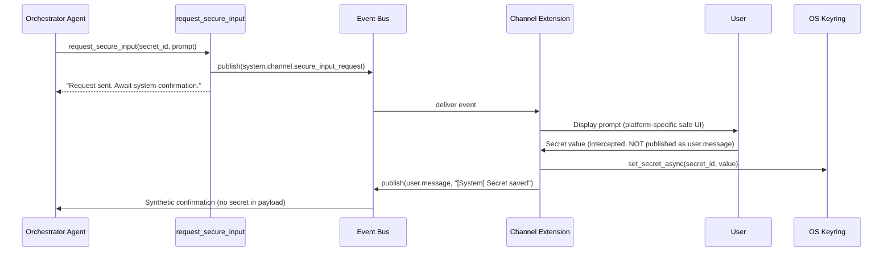

# ADR 012: Secure Secrets Management

## Status

Accepted (Phase 1 implemented), Phase 2 proposed.

## Context

The application handles API keys, bot tokens, and other credentials that must not leak into LLM context windows, conversation history, Memory, or logs. Before this ADR, all secrets were stored as plaintext in the `.env` file and loaded into `os.environ` at startup. This creates several risks:

1. **Plaintext on disk.** Anyone with filesystem access can read `.env`.
2. **Visible in process environment.** `os.environ` is readable by any code in the process and by child processes.
3. **No safe runtime collection path.** If an extension needs a new token at runtime (e.g. Telegram bot token), there is no mechanism to collect it from the user without the secret passing through the LLM context and being stored in Memory.

The application needs:

- **Secure storage**: secrets encrypted at rest via the OS credential store.
- **Headless fallback**: `.env` continues to work in CI/Docker/cron where no keyring backend is available.
- **Runtime collection**: a way to securely request secrets from users through any channel (CLI, Telegram, future web/Slack) without the secret ever reaching the LLM or Memory.

### Design constraints

- `core/secrets.py` must be provider-agnostic — no hardcoded key names.
- Keyring I/O is synchronous and potentially blocking (D-Bus RPC, KWallet unlock). It must not block the event loop.
- The LLM must never see secret values, not even transiently in a tool result.
- Channels are extensions with different I/O security properties (hidden input in CLI, message deletion in Telegram). The kernel must not mandate platform-specific behavior.

## Decision

### Phase 1: OS Keyring storage (implemented)

#### 1.1 `core/secrets.py` — centralised secret store

A new module provides the single API for all secret operations:

```
get_secret(name)          sync, keyring → os.environ fallback
get_secret_async(name)    async via asyncio.to_thread
set_secret(name, value)   sync, stores in keyring
set_secret_async(name, value)  async variant
delete_secret(name)       sync, no-op if absent
is_keyring_available()    True when a real OS backend is active
```

Resolution order: `keyring.get_password("yodoca", name)` → `os.environ.get(name)` → `None`.

The module has zero knowledge of provider names or key formats. Any string can be stored.

#### 1.2 Integration points

| Component | Before | After |
|---|---|---|
| `ModelRouter` (`core/runner.py`) | `secrets_getter=os.environ.get` | `secrets_getter=secrets.get_secret` |
| `ExtensionContext.get_secret()` | `os.environ.get(name)` | `await get_secret_async(name)` |
| `config_check.is_configured()` | `env_vars.get(secret)` | `secrets.get_secret(secret) or env_vars.get(secret)` |
| Onboarding `config_writer.py` | All to `.env` | Secrets to keyring (if available), rest to `.env` |
| Scripts (heartbeat, maintenance) | `os.environ.get` | `secrets.get_secret` |
| Embedding extension fallback | `os.environ.get("OPENAI_API_KEY")` | `await context.get_secret("OPENAI_API_KEY")` |

#### 1.3 Onboarding secret routing

`onboarding/config_writer.py` determines which `state.env_vars` keys are secrets by reading `api_key_secret` values from `state.providers` (no hardcoded list). If `is_keyring_available()` is `True`, those keys go to the keyring and are excluded from `.env`. If `False`, everything falls back to `.env` with a warning logged.

#### 1.4 No automatic migration

There is no migration from `.env` to keyring. To switch storage backend, users delete `config/settings.yaml` and `.env`, then re-run onboarding. This avoids `.env` rewriting risks and keeps the implementation simple.

---

### Phase 2: Secure runtime secret collection via channels (proposed)

#### Problem

Some secrets are not known at onboarding time. For example, a user might ask the agent "set up the Telegram channel" mid-conversation. The agent needs the bot token, but it must never appear in LLM context, Memory, or logs.

#### Pattern: Stateful Channel Interceptors

The core idea is **context break** — the secret collection is handled entirely by the transport channel, outside the LLM processing pipeline. The agent initiates the request, but never sees the secret value.



Key properties:

- **Zero-knowledge for LLM.** The agent tool returns a generic acknowledgement. The secret value never appears in any tool result, prompt, or event payload that reaches the LLM.
- **Zero-knowledge for Memory.** The intercepted message is not published to `user.message`, so it is never processed by the Memory ContextProvider or stored in the memory graph.
- **Ephemeral channel state.** The channel holds a queue of pending intercept requests. Each request is active only until the user responds, times out, or cancels. The secret lives in RAM for milliseconds before going to the keyring.

#### 2.1 New system topic

Add to `core/events/topics.py`:

```python
SECURE_INPUT_REQUEST = "system.channel.secure_input_request"
```

Payload contract:

```python
SECURE_INPUT_REQUEST_PAYLOAD = {
    "secret_id": "str",       # keyring key name
    "prompt": "str",          # user-facing prompt text
    "target_channel": "str",  # channel_id to handle the request
}
```

#### 2.2 New core tool: `request_secure_input`

A new tool in `core/tools/` that the agent can call when it needs a secret from the user. The tool:

1. Determines the originating `channel_id` from the invocation context.
2. Publishes a `system.channel.secure_input_request` event via the Event Bus.
3. Returns a generic string to the agent: *"Secure input request sent to user. Wait for system confirmation before proceeding."*

The tool result contains no secret. The agent does not need to (and cannot) process the secret itself.

#### 2.3 Channel interceptor — CLI

When `CliChannelExtension` receives the `secure_input_request` event:

1. Append request to `_intercept_queue` (asyncio.Queue).
2. In the input loop, before the normal `input()`, check if the queue is non-empty. Dequeue the front request.
3. Use `getpass.getpass(prompt)` — input is hidden from the terminal.
4. Store via `await set_secret_async(secret_id, value)`.
5. Emit a synthetic `user.message` event: `"[System] Secret '{secret_id}' saved successfully."` — this is what the agent sees.
6. If the user does not respond within `INTERCEPT_TIMEOUT` (default 60s) or types `/cancel`, clear the current request and emit: `"[System] Secret input for '{secret_id}' cancelled."`.
7. Proceed to the next queued request, or return to normal input mode.

The secret never touches `input()` (which would echo), `user.message` (which goes to Memory), or the agent context.

#### 2.4 Channel interceptor — Telegram

When `TelegramChannelExtension` receives the `secure_input_request` event:

1. Append request to `_intercept_queue` (asyncio.Queue). If this is the first pending request, send the prompt message to the user.
2. In the message handler (`on_message`), check `_intercept_queue` **before** emitting `user.message`.
3. If a request is pending:
   - **Immediately delete** the user's message from the Telegram chat (`message.delete()`) to remove the secret from the UI and Telegram servers.
   - Store via `await set_secret_async(secret_id, value)`.
   - Dequeue the completed request. Emit synthetic `user.message`: `"[System] Secret '{secret_id}' saved."`.
   - If the queue has more pending requests, send the next prompt. Otherwise, return to normal mode.
   - **Return early** — do not publish the original message.
4. If the user does not respond within `INTERCEPT_TIMEOUT` (default 60s) or sends `/cancel`:
   - Dequeue and discard the current request.
   - Emit synthetic `user.message`: `"[System] Secret input for '{secret_id}' cancelled."`.
   - If more requests are queued, send the next prompt.

If the bot lacks delete permissions, the message is still intercepted (not forwarded to the agent), but a warning is logged. The secret reaches the keyring regardless.

#### 2.5 Generic channel contract

Any future channel (web, Slack, etc.) implements the same pattern:

1. Subscribe to `system.channel.secure_input_request` during `initialize()`.
2. Maintain a FIFO queue of intercept requests (not a single scalar). When a `secure_input_request` event targets this channel, enqueue it.
3. Process one request at a time: display the prompt, collect the next user input via platform-appropriate secure UI.
4. Store in keyring, emit synthetic confirmation, dequeue, proceed to the next request or return to normal mode.
5. Implement timeout (`INTERCEPT_TIMEOUT`, default 60s) and explicit cancellation (`/cancel`). On timeout or cancel, emit a synthetic cancellation message and dequeue.

This is not a new Protocol — it is a behavioral convention documented here. Channels opt in by subscribing to the topic. Channels that do not subscribe simply ignore the event, and the agent receives no confirmation (the agent should handle the absence of confirmation gracefully, e.g. by informing the user that the channel does not support secure input).

#### 2.6 Timeout, cancellation, and concurrency

**Timeout.** If the user does not respond within `INTERCEPT_TIMEOUT` (configurable, default 60 seconds), the channel automatically cancels the pending request, emits a synthetic cancellation message to the agent, and returns to normal mode. This prevents the channel from being stuck in interception mode indefinitely.

**Explicit cancellation.** The user can type `/cancel` (or the platform equivalent) to abort the current secret input. The channel treats this the same as a timeout.

**Request queue.** Channels maintain a FIFO queue (`asyncio.Queue`) of intercept requests, not a single `_awaiting_secret_id` scalar. This handles the case where the agent (or multiple concurrent agents) requests two or more secrets in quick succession. The channel processes them one at a time, displaying each prompt in order.

#### 2.7 Protection against malicious tool invocation

The `request_secure_input` tool is called by the LLM, which means the `secret_id` and `prompt` parameters are LLM-generated. An adversarial prompt injection could trick the agent into requesting a secret under false pretenses (e.g. "Enter your bank password").

**`secret_id` sanitization.** The tool must validate `secret_id` against an allowlist pattern (e.g. `^[a-zA-Z_][a-zA-Z0-9_]{0,63}$`). This prevents OS keyring injection and limits the keyring namespace to predictable identifiers.

**Prompt framing.** Channels must prepend a non-removable system-level warning to the LLM-generated prompt, clearly indicating that the request originates from the AI agent:

- CLI: `"[Security] The AI agent requests secure input: {prompt} (input hidden): "`
- Telegram: `"⚠️ Agent requests secure input:\n{prompt}\nYour next message will be saved to encrypted storage and deleted from chat."`

This ensures the user always knows the prompt was generated by the AI, not by a trusted system component. The framing text is hardcoded in the channel implementation and cannot be modified by the LLM.

#### 2.8 Security properties

| Property | Guarantee |
|---|---|
| Secret not in LLM context | Tool returns generic text; secret value never in any tool result |
| Secret not in Memory | Intercepted message not published to `user.message`; synthetic confirmation contains no secret |
| Secret not in event journal | Secret stored directly to keyring; only the confirmation event (no value) is journaled |
| Secret not in logs | Channel implementations must not log the intercepted value; `core/secrets.py` does not log values |
| Secret not on screen (CLI) | `getpass.getpass()` suppresses echo |
| Secret not in chat history (Telegram) | `message.delete()` removes from Telegram servers (best-effort; requires bot admin rights) |
| No stale interception state | Timeout (60s) and `/cancel` prevent the channel from silently consuming unrelated messages |
| No social engineering via LLM | Channel-hardcoded warning prefix makes the AI origin of the prompt explicit to the user |
| `secret_id` is safe | Allowlist validation prevents OS keyring injection or namespace pollution |

## File Structure (Phase 2 additions)

```
core/
├── secrets.py               ← EXISTS: Phase 1, no changes needed
├── events/
│   └── topics.py            ← MODIFIED: add SECURE_INPUT_REQUEST topic
└── tools/
    └── secure_input.py      ← NEW: request_secure_input tool

sandbox/extensions/
├── cli_channel/
│   └── main.py              ← MODIFIED: add intercept handler + getpass
└── telegram_channel/
    └── main.py              ← MODIFIED: add intercept handler + message.delete
```

## Implementation Plan

### Phase 1 (completed)

1. `core/secrets.py` — keyring wrapper with sync/async API and env fallback.
2. `pyproject.toml` — `keyring>=25.0.0` dependency.
3. Integration into `ModelRouter`, `ExtensionContext`, `config_check`, onboarding, scripts, embedding.
4. Tests: `test_secrets.py`, updated `test_config_writer.py` and `test_config_check.py`.
5. Documentation: `docs/secrets.md`.

### Phase 2 (proposed)

1. Add `SECURE_INPUT_REQUEST` topic to `core/events/topics.py`.
2. Create `core/tools/secure_input.py` with `request_secure_input` tool.
3. Register the tool in `CoreToolsProvider`.
4. Add interceptor to `CliChannelExtension`: subscribe to event, `getpass` collection, synthetic confirmation.
5. Add interceptor to `TelegramChannelExtension`: subscribe to event, `message.delete`, synthetic confirmation.
6. Tests: mock-based tests for each channel's intercept flow.

## Consequences

### Benefits

- **Defense in depth.** Phase 1 encrypts secrets at rest. Phase 2 ensures secrets never transit through the AI pipeline.
- **Provider-agnostic.** No hardcoded key names anywhere in the kernel. Extensions and channels store arbitrary secrets.
- **Headless-safe.** `.env` fallback works transparently in CI/Docker/cron with zero code changes.
- **Extensible.** New channels implement the interceptor pattern without kernel changes. The event bus decouples the agent from channel-specific I/O.
- **User trust.** Hidden input (CLI) and message deletion (Telegram) demonstrate visible security to the user.

### Trade-offs

| Trade-off | Impact |
|---|---|
| **`keyring` adds OS dependency** | On headless Linux without `libsecret`, the fail backend activates and `.env` fallback kicks in. No breakage, but no encryption at rest. |
| **Telegram `message.delete` requires admin rights** | If the bot lacks permission, the secret remains in chat history. Mitigation: the interceptor logs a warning; the secret still reaches the keyring securely. |
| **No migration** | Existing installations must re-run onboarding after upgrade. Acceptable for the current user base. |
| **Interception timeout window** | If the user does not respond, the request expires after `INTERCEPT_TIMEOUT` (60s). During this window, any message is treated as the secret. Mitigation: timeout auto-cancels; `/cancel` provides explicit escape. |
| **LLM-generated prompts may mislead** | The agent generates `secret_id` and `prompt`. A prompt-injected agent could craft a phishing prompt. Mitigation: channels prepend a hardcoded warning that the request originates from the AI. |

### Risks

| Risk | Severity | Mitigation |
|---|---|---|
| **Keyring unlock dialog blocks headless startup** | Medium | `is_keyring_available()` detects the fail backend. In headless mode, keyring is never called. |
| **Secret logged by third-party middleware** | Low | `core/secrets.py` never logs values. Channel implementations document the no-log requirement. |
| **Race condition: two channels intercept same request** | Low | `target_channel` in the event payload ensures only one channel handles the request. |
| **User sends secret before interception mode activates** | Low | Event bus delivery is fast (in-process). The timing window between event publish and channel state change is sub-millisecond. |
| **Concurrent secret requests clobber state** | Low | Channels use a FIFO queue, not a scalar. Requests are processed sequentially. |
| **Adversarial `secret_id` from prompt injection** | Medium | `secret_id` validated against `^[a-zA-Z_][a-zA-Z0-9_]{0,63}$`. Invalid IDs rejected by the tool before reaching the event bus. |

## Relation to Other ADRs

- **ADR 001** — Supervisor process model: `core/secrets.py` is imported by both supervisor and core. Keyring is per-OS-user, so both processes access the same secrets.
- **ADR 002** — Extension architecture: channels implement the interceptor as a behavioral opt-in, not a new Protocol. `ExtensionContext.get_secret()` is the standard API.
- **ADR 004** — Event Bus: Phase 2 adds `system.channel.secure_input_request` as a new system topic.
- **ADR 011** — Onboarding: Phase 1 modifies the onboarding config writer to route secrets to keyring. The onboarding wizard remains the primary secret collection path for provider API keys.
